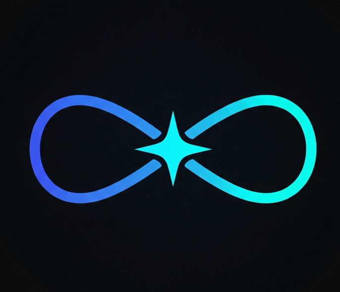

# 🌌 SPACE - Crypto Social Space Platform

<div align="center">
  
  
  <h3>Where crypto meets community - IRL</h3>
  
  <p align="center">
    <strong>Blockchain-secured social spaces for crypto communities at real-world events</strong>
  </p>
  
  [](https://solana.com/)
  [](https://web3auth.io/)
  [](https://sns.id/)
  [](https://nextjs.org/)
  [](https://www.typescriptlang.org/)
</div>

---

## 🚀 About SPACE

**SPACE** is a blockchain-secured social platform that creates trustless spaces for crypto communities at real-world events. Built on Solana with Web3Auth and SNS (Solana Name Service) integration, this platform enables secure interactions where community members stake SOL as collateral to participate in event-specific spaces.

### 🎯 The Problem We Solve

**Trust Issues at Events:**
- Scammers and fake profiles at crypto meetups
- Unreliable vendors and shops at conferences  
- People not paying their share of group expenses
- Items borrowed but never returned
- No accountability for bad behavior

**Fragmented Social Experience:**
- Disconnected social interactions at crypto events
- No unified platform for event-specific commerce
- Limited ways to monetize community participation
- Lack of reputation systems for real-world interactions

### 💡 Our Solution

**Core Innovation: Blockchain-Secured Social Spaces**

We've created a social platform where every interaction is secured by blockchain technology, creating a trustless environment where community members have real skin in the game through SOL staking.

**Key Features:**
- **🛍️ Onchain Commerce**: Crypto-enabled shops with community rating
- **📦 IRL Item Lending**: Lend physical items with custom security deposits
- **💰 Community Requests**: Paid requests for services and help
- **🤝 Safe Hangouts**: Organize meetups with crypto security
- **🗳️ Decentralized Voting**: On-chain voting for all content and disputes

### 🔐 Authentication & Security

- **Web3Auth Wallet Connection**: Seamless wallet connection using Web3Auth modal
- **SNS Profile Creation**: Every user must create an on-chain SNS (Solana Name Service) profile
- **Enhanced Auth Guard**: Multi-layered authentication requiring both profile and stake
- **Minimum Stake Requirement**: 0.001 SOL minimum to participate in spaces
- **Multi-Layer Security**: Web3Auth + SNS + Staking requirements for all actions

### 🎮 Event-Specific Social Spaces

- **Search & Discovery**: Find spaces by event name or city using the homepage search
- **Space Creation**: Community members can create spaces for specific events
- **Feature Toggle**: Each space can enable/disable specific features (shops, lend, request, hangout)
- **Admin Controls**: Space creators can set rules and moderation
- **3D Space Scene**: Interactive 3D visualization using Three.js

---

## 🧠 System Architecture Mind Map

```
                    🌌 SPACE Platform
                         │
        ┌────────────────┼────────────────┐
        │                │                │
    🔐 Web3Auth   🏷️ SNS (Solana Name Service)   💰 Smart Contracts
        │                │                │
        ▼                ▼                ▼
   ┌─────────┐      ┌─────────┐      ┌─────────┐
   │ Wallet  │      │ Solana  │      │ Staking │
   │ Connect │      │ Names   │      │ Program │
   │ Modal   │      │ Service │      │         │
   └─────────┘      └─────────┘      └─────────┘
        │                │                │
        ▼                ▼                ▼
   ┌─────────┐      ┌─────────┐      ┌─────────┐
   │ User    │      │ Profile │      │ Voting  │
   │ Auth    │      │ Mgmt    │      │ Program │
   │ System  │      │ System  │      │         │
   └─────────┘      └─────────┘      └─────────┘
        │                │                │
        └────────────────┼────────────────┘
                         │
                    🎮 Frontend App
                         │
        ┌────────────────┼────────────────┐
        │                │                │
    🎨 3D Spaces    🛍️ Crypto Shops   📱 Modern UI
        │                │                │
        └────────────────┼────────────────┘
                         │
                    🖥️ Backend Services
                         │
        ┌────────────────┼────────────────┐
        │                │                │
    📊 SNS API (Solana Name Service)   🗄️ Database   🔗 Blockchain
        │                │                │
        └────────────────┼────────────────┘

Flow Direction:
Web3Auth → User Auth → Frontend → Backend → Smart Contracts
SNS (Solana Name Service) → Profile Mgmt → Frontend → Backend → Database
Smart Contracts → Onchain Data → Frontend → User Interface
```

---

## 🏗️ Technical Architecture

### Smart Contracts (Deployed on Solana Devnet)

#### 1. **Staking Program** 
- **Program ID**: `HiTfqcaU6XwKVYcudqCLAZKzCFjCyXQxZ1LQkn2PcEks`
- **Deployed Contract**: [View on Solana Devnet Explorer](https://explorer.solana.com/address/HiTfqcaU6XwKVYcudqCLAZKzCFjCyXQxZ1LQkn2PcEks?cluster=devnet)
- **Features**:
  - Vault System: Program Derived Addresses for user vaults
  - Instructions: `init_vault` and `deposit` instructions
  - Minimum Stake: 0.001 SOL (0.0001 SOL minimum validation)
  - Security: User funds locked in Program Derived Addresses

#### 2. **Voting Program**
- **Program ID**: `5zQieQbJebHJdxpURBSswrVbHWtKXZHx6EF1gEzNrXZp`
- **Deployed Contract**: [View on Solana Devnet Explorer](https://explorer.solana.com/address/5zQieQbJebHJdxpURBSswrVbHWtKXZHx6EF1gEzNrXZp?cluster=devnet)
- **Features**:
  - Instructions: `upvote` and `downvote` with discriminators
  - PDA Seeds: `[b"item", item_id]` and `[b"vote_tracker", item_id, voter]`
  - Vote Tracking: Prevents double voting through vote tracker PDAs
  - Community Justice: Voting system to penalize rule breakers

### Frontend Stack
- **Framework**: Next.js 15.2.4 with React 19
- **UI Components**: Radix UI with Tailwind CSS
- **3D Graphics**: Three.js with React Three Fiber
- **State Management**: React hooks and local state
- **Forms**: React Hook Form with Zod validation

### Blockchain Integration
- **Network**: Solana Devnet (`https://api.devnet.solana.com`)
- **Wallet**: Web3Auth Modal for Solana
- **SNS Integration**: `@bonfida/spl-name-service` for on-chain identity
- **Transaction Handling**: Web3Auth's `useSignAndSendTransaction` hook

### Data Management
- **Database**: In-memory mock database (JSON-based)
- **Data Types**: Spaces, Shops, LendItems, Requests, Hangouts
- **Voting**: Local vote count updates with blockchain verification
- **Persistence**: Currently mock data, ready for database integration

---

## 🎮 User Journey

### New User Onboarding
1. **Wallet Connection**: Connect via Web3Auth modal
2. **SNS Profile Creation**: Create on-chain SNS identity
3. **Initial Staking**: Stake minimum 0.001 SOL
4. **Space Discovery**: Search for events or cities
5. **Feature Exploration**: Explore shops, lending, requests, hangouts

### Active User Experience
1. **Space Participation**: Join event-specific spaces
2. **Commerce**: Buy/sell items, rate shops
3. **Lending**: Borrow/lend physical items
4. **Community**: Create requests, plan hangouts
5. **Governance**: Vote on content, report issues

### Authentication Flow
1. **Web3Auth Check**: Verify wallet connection
2. **SNS Profile Check**: Verify on-chain identity exists
3. **Stake Verification**: Check minimum stake requirements
4. **Action Authorization**: Allow/deny based on requirements

---

## 💰 Economic Model

### Staking Economics
- **Minimum Stake**: 0.001 SOL to participate
- **Validation**: 0.0001 SOL minimum for transactions
- **Vault System**: User funds locked in Program Derived Addresses
- **Security**: Stakes act as collateral for platform participation
- **Fund Locking**: User funds remain locked until they leave the space

### Reward & Slashing System

The platform implements a sophisticated slashing mechanism that ensures community accountability and rewards good behavior. When a user violates rules or provides incorrect data, their staked SOL is slashed and distributed proportionally to other community members based on their stake size.

**Example Scenario:**
- Alice stakes 0.5 SOL but adds fake shop data to the space
- Bob stakes 2.0 SOL and follows all rules
- Charlie stakes 1.0 SOL and is an active community member
- Total community stake: 3.5 SOL

When Alice's 0.5 SOL gets slashed for rule violation:
- Bob receives: (2.0 ÷ 3.5) × 0.5 = 0.286 SOL (57.1% of slashed funds)
- Charlie receives: (1.0 ÷ 3.5) × 0.5 = 0.143 SOL (28.6% of slashed funds)
- Remaining 0.071 SOL goes to other smaller stakers

This creates strong economic incentives for users to maintain high-quality contributions and follow community rules, as bad actors lose their stake while good actors are rewarded proportionally to their commitment level.

### Fee Structure
- **Transaction Fees**: Solana network fees only
- **No Platform Fees**: Currently no additional fees
- **Gas Optimization**: Efficient transaction batching

---

## 🔒 Security Features

### Smart Contract Security
- **Program Derived Addresses**: Secure account management
- **Discriminator Validation**: Instruction validation through discriminators
- **Vote Tracking**: Prevents double voting through PDA system
- **Vault System**: Secure staking with user-controlled vaults
- **Slashing Protection**: Admin can slash funds for rule violations
- **Community Justice**: Slashed funds distributed proportionally to stakers

### User Protection
- **Multi-Layer Auth**: Web3Auth + SNS + Staking requirements
- **Enhanced Auth Guard**: Comprehensive permission system
- **Stake Requirements**: Financial skin in the game
- **Community Voting**: Decentralized content moderation

---

<div align="center">
  <p><strong>Built with ❤️ for the Web3Auth and SNS communities</strong></p>
  <p>Where crypto meets community - making Web3 social, one space at a time 🌌</p>
</div>
